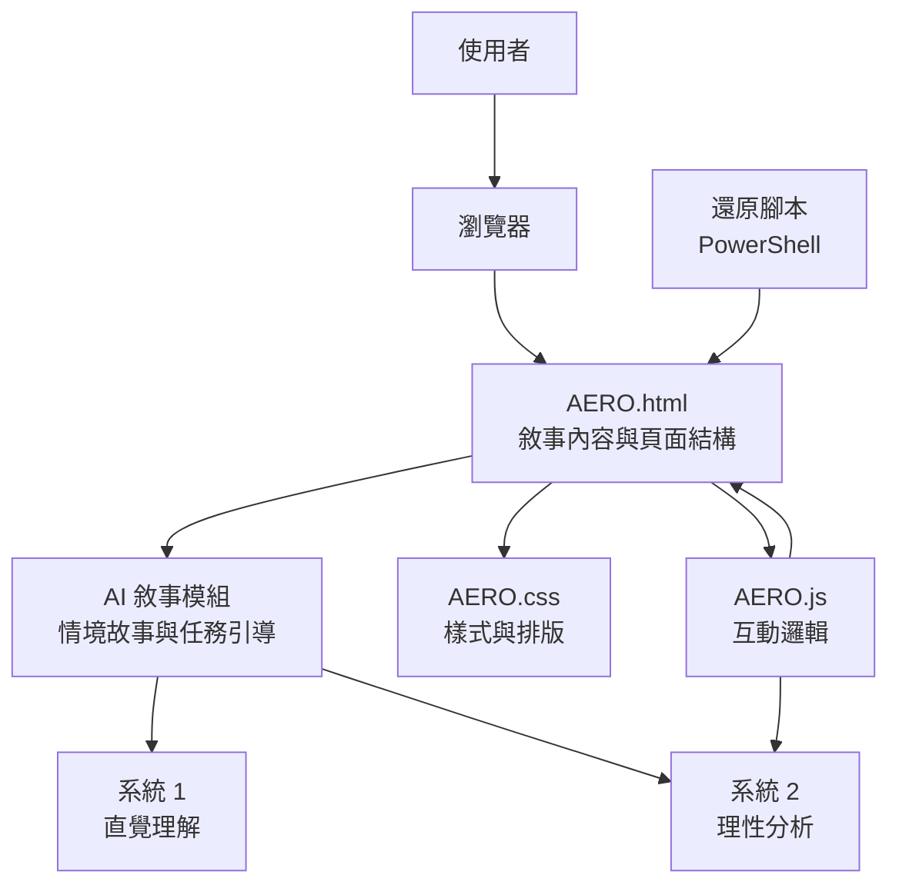

# AERO 專案說明

這個專案是一個以 AI 敘事風格為核心、結合雙重歷程理論（Dual-Process Theory）的商管教育行銷網頁系統。系統透過故事化內容與互動設計，協助學習者快速理解商管情境，並引導其進一步進行理性分析與決策。

主要由下列檔案組成：

- `AERO.html`：頁面結構
- `AERO.css`：樣式設定
- `AERO.js`：互動邏輯
- `restore_aero_html.ps1`：還原 AERO HTML 的 PowerShell 腳本
- `restore_best_aero_html.ps1`：還原最佳版本 AERO HTML 的 PowerShell 腳本

## 系統在做什麼

AERO 在瀏覽器中運作，核心目標是把「教學敘事」與「行銷引導」整合在同一個互動介面，並以雙重歷程理論設計使用者體驗。

系統主要工作如下：

1. 以 AI 敘事風格呈現商管案例，先用情境故事吸引注意力與代入感。
2. 對應雙重歷程理論中的系統 1（直覺反應）：用短句、視覺重點、情境提示降低理解門檻。
3. 對應雙重歷程理論中的系統 2（理性分析）：透過互動內容引導使用者比較方案、思考因果與策略選擇。
4. 用前端分層架構將內容、樣式與互動拆開，讓教學素材與行銷訊息可以快速調整。
5. 當頁面被誤改或破壞時，可透過 PowerShell 還原腳本回復既定版本。

簡單來說，這個系統是在「靜態網頁 + 前端互動」基礎上，加入「AI 敘事教學 + 雙重歷程引導」的商管教育行銷設計。

## 系統架構

### 架構分層

- 表現層（View）：`AERO.html`
- 樣式層（Style）：`AERO.css`
- 行為層（Behavior）：`AERO.js`
- 維運工具層（Ops Utility）：`restore_aero_html.ps1`、`restore_best_aero_html.ps1`

### 執行流程

1. 使用者以瀏覽器開啟 `AERO.html`。
2. 系統先展示 AI 敘事式商管情境（吸引注意與建立脈絡）。
3. `AERO.css` 套用視覺層次，強化重點訊息與閱讀流向。
4. `AERO.js` 綁定互動事件，讓使用者在點擊、切換或閱讀過程中逐步進入分析任務。
5. 流程設計同時涵蓋：
	- 快速理解（系統 1）：先看懂故事與關鍵問題。
	- 深度判斷（系統 2）：再進行比較、推理與策略判斷。
6. 若內容異常，使用還原腳本將檔案回復。

## 網頁操作與系統運作（整合版）

1. 開啟頁面：直接在瀏覽器打開 `AERO.html`。
2. 進入敘事：先閱讀 AI 風格的商管情境與任務說明。
3. 互動探索：依頁面按鈕或區塊進行操作，查看不同資訊或觀點。
4. 形成判斷：根據內容提示完成策略思考，從直覺反應走向理性決策。
5. 維護更新：
	- 想改教學內容：調整 `AERO.html`。
	- 想改視覺與品牌風格：調整 `AERO.css`。
	- 想改互動節奏與邏輯：調整 `AERO.js`。
6. 版本還原：若操作錯誤，可執行 PowerShell 還原腳本。

### 架構圖（邏輯）

## 快速開始

1. 直接用瀏覽器開啟 `AERO.html`。
2. 若你使用 VS Code，可以安裝 Live Server 擴充套件後即時預覽。

## 修改

- 要調整版面與配色：修改 `AERO.css`
- 要調整內容結構：修改 `AERO.html`
- 要新增互動功能：修改 `AERO.js`

## 研究者模式與資料維護

1. 研究者模式開啟方式：
- 在網址加上 `?researcher=1` 可顯示研究者控制項與首頁後台入口。
- 在網址加上 `?researcher=1&backend=1` 可直接進入後台頁。

2. 12 種條件規則（目前固定）：
- 餘數 `0/1/2/3` 決定課程版本順序。
- AI 體驗順序固定為 `Perplexity -> ChatGPT -> Google AI Overviews`。
- 每位使用者資料會存於瀏覽器 localStorage（鍵值：`aero_backend_records`）。

3. 調整課程價格與內容：
- 主要課程版本資料在 `AERO.js` 的 `SC_DATA`。
	- 可修改：課程標題、描述、價格、統計、講師、課綱與 CTA 文案。
- 推薦課程資料在 `AERO.js` 的 `HAHOW_BIZ_COURSES`。
	- 可修改：`title`、`price`、`url`、`scenarioKey`。

4. 後台匯出：
- 後台提供「匯出全部 CSV」與「複製全部 JSON」，可直接帶走所有受測者紀錄。

## 備註

如果頁面內容被誤改，可以使用 PowerShell 還原腳本恢復版本。
